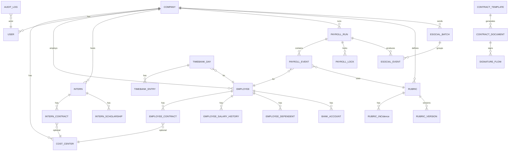

# Arquitetura e ERD (HRPro)

Data: 2026-02-05

## 1) Visao geral
- Frontend: React + TypeScript + Tailwind/shadcn (base atual), consumo de API REST.
- Backend: NestJS + TypeScript com arquitetura modular.
- Banco: PostgreSQL com Prisma.
- Filas: BullMQ + Redis (processamento de folha, eSocial, importacoes).
- Relatorios: PDF (holerite/TRCT/recibos) + CSV/XLSX.
- Auditoria: tabela de log para mudancas criticas.
- Multiempresa: segregacao por unidade (CNPJ), com visao consolidada para admin.

## 2) Componentes e responsaveis

### 2.1) Frontend
- Modulos principais: cadastro, folha, banco de horas, contratos, estagiarios, eSocial, relatorios.
- Autenticacao: JWT + refresh token.
- Permissoes por perfil: admin, RH, gestor, funcionario, estagiario.

### 2.2) Backend (NestJS)
Modulos sugeridos:
- Auth
- Tenancy (unidades)
- People (funcionarios, estagiarios, dependentes)
- Contracts
- Payroll (motor de folha e rubricas)
- Benefits (VT/VA)
- TimeBank
- Documents (templates, assinaturas, arquivos)
- ESocial
- Imports
- Reports
- Audit

### 2.3) Filas (BullMQ)
- payroll.calculate (processamento folha por competencia)
- payroll.close (fechamento com versao)
- esocial.generate (geracao de eventos)
- esocial.submit (envio e reprocessamento)
- imports.xlsx (importacao planilha)
- reports.generate (geracao PDF/CSV/XLSX)

## 3) ERD (alto nivel)
Observacoes:
- `company_id` em quase todas as tabelas para multiempresa.
- Centro de custo opcional, obrigatorio apenas no envio eSocial.
- Competencia com fechamento e versao imutavel.

### 3.1) Diagrama ER (Mermaid)

## 4) Entidades chave (resumo)
- COMPANY: unidade/CNPJ, dados fiscais.
- COST_CENTER: centro de custo (opcional, eSocial obrigatorio).
- USER: acesso ao sistema.
- EMPLOYEE: dados pessoais e trabalhistas (CLT).
- INTERN: dados de estagiarios (TSVE).
- EMPLOYEE_CONTRACT/INTERN_CONTRACT: contrato vigente e historico.
- RUBRIC: rubricas parametrizaveis por competencia.
- PAYROLL_RUN: competencia + tipo (mensal, 13o, ferias, PLR, rescisao).
- PAYROLL_EVENT: resultados por empregado/rubrica.
- TIMEBANK_*: banco de horas.
- CONTRACT_TEMPLATE/DOCUMENT: modelos e documentos.
- ESOCIAL_*: batches, eventos, recibos, erros.
- AUDIT_LOG: auditoria de mudancas criticas.

## 5) Plano de importacao (macro)
- Cadastro Funcionarios -> EMPLOYEE + BANK_ACCOUNT + DEPENDENTS.
- Quantidade de aula -> base de salario/horas para professores.
- Tab auxilio -> tabelas INSS/IRRF por competencia.
- Folhas (mensal/13o/ferias/PLR) -> PAYROLL_RUN + PAYROLL_EVENT (historico).
- VT -> BENEFIT_RULE + BENEFIT_REQUEST.
- Holerite/TRCT/Recibo -> templates e validacao de layout.

## 6) Observacoes de consistencia
- #REF! nas abas de folha e ferias serao resolvidos durante mapeamento das regras.
- A logica de Excel nao sera usada em runtime; sera reescrita em regras de dominio.

---
Fim do documento.
